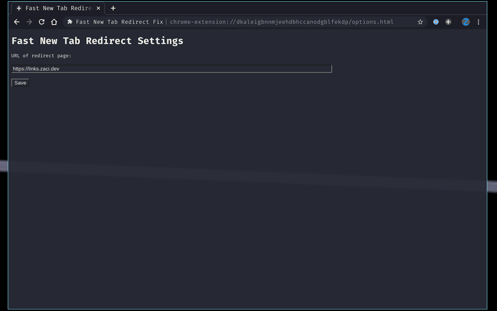

# Fast New Tab Redirect Reborn

A rebirth of the
[fast-new-tab-redirect](https://chrome.google.com/webstore/detail/fast-new-tab-redirect/ohnfdmfkceojnmepofncbddpdicdjcoi?hl=en)
by fumito80.

Official Chrome Web Store listing:
[Fast New Tab Redirect Reborn](https://chrome.google.com/webstore/detail/fast-new-tab-redirect-reb/acgndeknalmchjdgfibacnacagfmgkfm/related)

## Overview

Change the redirect page to something a little more personal.

This extension enables to user to select custom URLs to replace their
default Chrome new tab page.

Although the new tab page has gotten better of these years, some (myself
included) require something a little personal. This extension allows
user freedom in a lightweight and snappy package.

## Whats different?

Sadly I found that there wasn't many options for new tab redirect
extensions that suited my needs.

I used to ping pong between
[new tab redirect](https://chrome.google.com/webstore/detail/new-tab-redirect/icpgjfneehieebagbmdbhnlpiopdcmna)
and
[new tab reloader](https://chrome.google.com/webstore/detail/new-tab-changer/occbjkhimchkolibngmcefpjlbknggfh).
I wasn't quite happy with either as I found them to be very slow
(selecting and clearing the URL in the omni bar) and would frequently
break with new chromium updates. (Requiring me to ctrl + l on each new
tab). I also didn't like the non-open source nature of the latter
option.

Instead, I researched around and found the project
[fast new tab redirect](https://chrome.google.com/webstore/detail/fast-new-tab-redirect/ohnfdmfkceojnmepofncbddpdicdjcoi?hl=en)
and absolutely loved the speed and simplicity of it. Sadly, the last
update was in 2016 (meaning that it has become stale) and I wished there
was more features and a nicer design.

Currently, this implementation takes off from where that extension was
left and re-skins the extension with dark theme and a new icon. In near
future when I find the time I intend to configure syncing of the URL
across browsers using the
[chrome.storage](https://developer.chrome.com/extensions/storage) api. I
also hope to add some other quality of life functionality such as a
favourites list.

## Privacy Policy:

Regarding the permissions required to automate the new URL redirect,
this extension does not and will never record any user data. There is no
hidden communication with any external sites.

This project is open source, and I would love your input to what should
be changed, as well as any improvements.

## Screenshot

## Authors

- Zac Scott (scottzach1)

## Original Author

- fumito80
